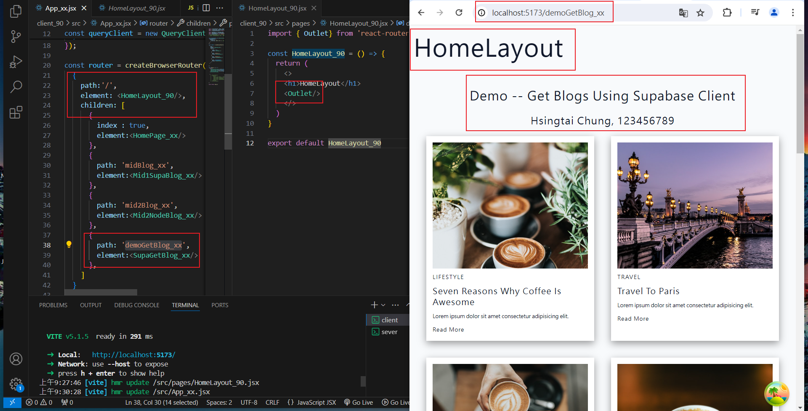
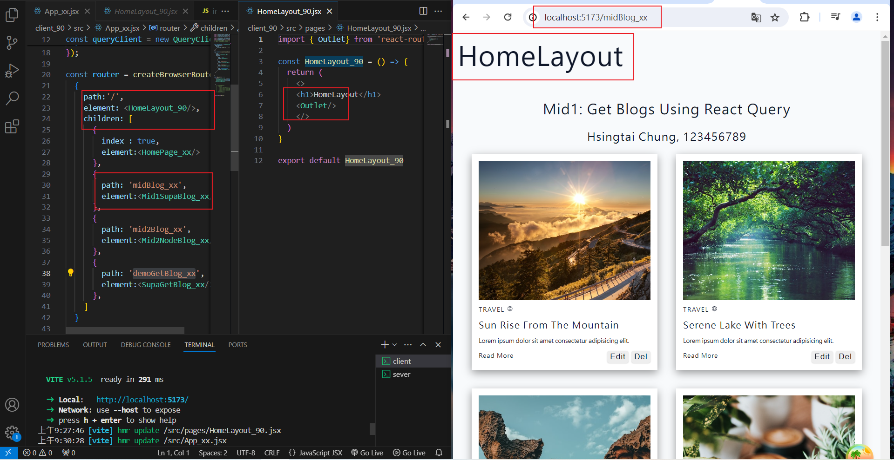

[My Github URL](https://github.com/Sky00l/1112-wp2-2N_90.git)

### ### W10-P1: Create HomeLayout_xx for all routes
 

 


```

$ git log --pretty=format:"%h%x09%an%x09%ad%x09%s" --after="2024-03-26"
07db355 Sky00l  Wed Mar 27 19:19:43 2024 +0800  W6-P1: Update a task in Supabase

```

### ### W6-P2: Delete a task in Supabase
 
#### => local
 

 
#### => Vercel: insert a task, edit the task, delete the task
 


```

 git log --pretty=format:"%h%x09%an%x09%ad%x09%s" --after="2024-03-26"
d9cded4 Sky00l  Wed Mar 27 21:23:37 2024 +0800  W6-P2: Delete a task in Supabase
831b2fe Sky00l  Wed Mar 27 21:14:27 2024 +0800  W6-P3: Get all tasks from node server
07db355 Sky00l  Wed Mar 27 19:19:43 2024 +0800  W6-P1: Update a task in Supabase

```

###  ### W6-P3: Get all tasks from node server
 

 


```


$ git log --pretty=format:"%h%x09%an%x09%ad%x09%s" --after="2024-03-26"
831b2fe Sky00l  Wed Mar 27 21:14:27 2024 +0800  W6-P3: Get all tasks from node server
07db355 Sky00l  Wed Mar 27 19:19:43 2024 +0800  W6-P1: Update a task in Supabase

```

### W5-P4: Create new Task, deploy W5-P3 to Vercel
 
#### => local
 

 
#### => vercel
 


```

git log --pretty=format:"%h%x09%an%x09%ad%x09%s" --after="2024-03-19"
04cee1f Sky00l  Sat Mar 23 11:01:28 2024 +0800  W5-P4: Create new Task, deploy W5-P3 to Vercel9b7db24 Sky00l  Sat Mar 23 09:55:18 2024 +0800  W5-P3: Deploy W5-P2 to Vercel
2b7da85 Sky00l  Wed Mar 20 18:38:54 2024 +0800  W5-P1: Create task_xx table in Supabase with 4 data using SQL

``

### W5-P5: Git logs of W5

```

git log --pretty=format:"%h%x09%an%x09%ad%x09%s" --after="2024-03-19"
04cee1f Sky00l  Sat Mar 23 11:01:28 2024 +0800  W5-P4: Create new Task, deploy W5-P3 to Vercel9b7db24 Sky00l  Sat Mar 23 09:55:18 2024 +0800  W5-P3: Deploy W5-P2 to Vercel
2b7da85 Sky00l  Wed Mar 20 18:38:54 2024 +0800  W5-P1: Create task_xx table in Supabase with 4 data using SQL

```
