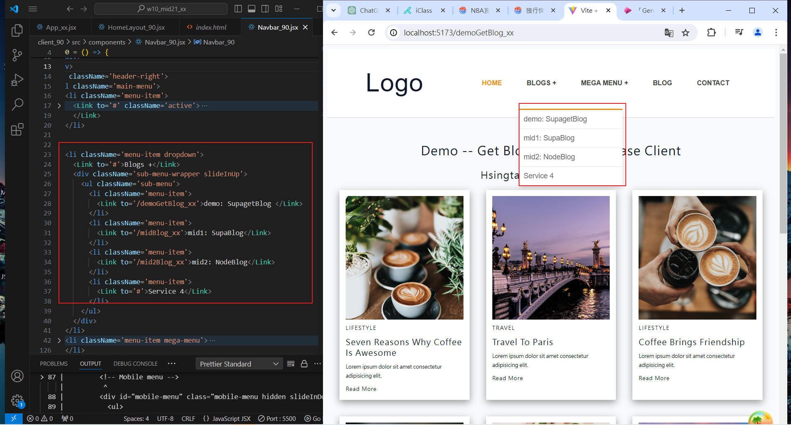
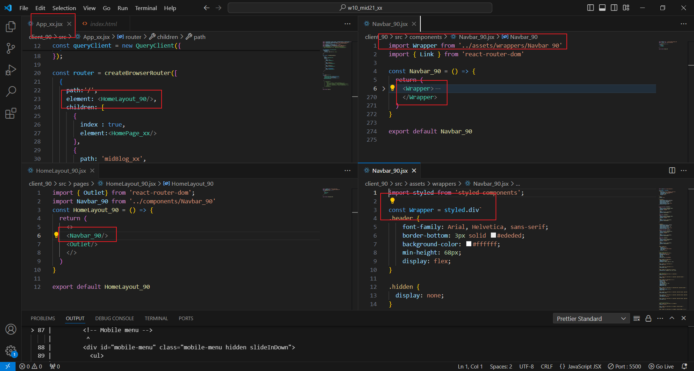

[My Github URL](https://github.com/Sky00l/1112-wp2-2N_90.git)

### ### W10-P1: Create HomeLayout_xx for all routes
 

 


```

$ git log --pretty=format:"%h%x09%an%x09%ad%x09%s" --after="2024-05-03"
5ed63bc Sky00l  Sat May 4 09:55:52 2024 +0800   W10-P1: Create HomeLayout_xx for all routes

```

### ### W10-P2: Add Navbar_xx with 3 menu items
 

 


```

$  git log --pretty=format:"%h%x09%an%x09%ad%x09%s" --after="2024-05-03"
7c215c1 Sky00l  Sat May 4 11:47:49 2024 +0800   W10-P2: Add Navbar_xx with 3 menu items
5ed63bc Sky00l  Sat May 4 09:55:52 2024 +0800   W10-P1: Create HomeLayout_xx for all routes  

```

### W10-P3: Get all blogs using route /mid1Blog_xx (自行完成)


 


```


$  git log --pretty=format:"%h%x09%an%x09%ad%x09%s" --after="2024-05-03"
7c215c1 Sky00l  Sat May 4 11:47:49 2024 +0800   W10-P2: Add Navbar_xx with 3 menu items
5ed63bc Sky00l  Sat May 4 09:55:52 2024 +0800   W10-P1: Create HomeLayout_xx for all routes  


### W10-P4: Git logs of W10

```

$  git log --pretty=format:"%h%x09%an%x09%ad%x09%s" --after="2024-05-03"
7c215c1 Sky00l  Sat May 4 11:47:49 2024 +0800   W10-P2: Add Navbar_xx with 3 menu items
5ed63bc Sky00l  Sat May 4 09:55:52 2024 +0800   W10-P1: Create HomeLayout_xx for all routes  

```
