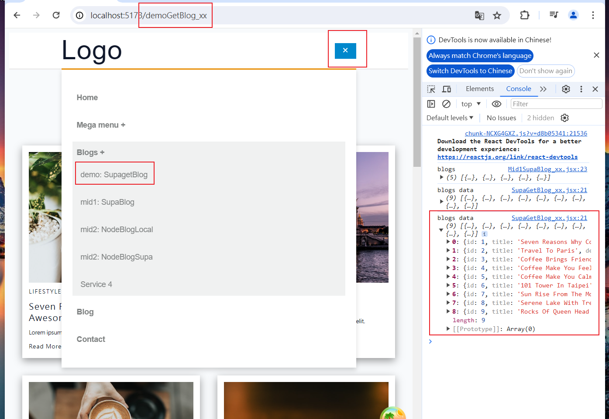
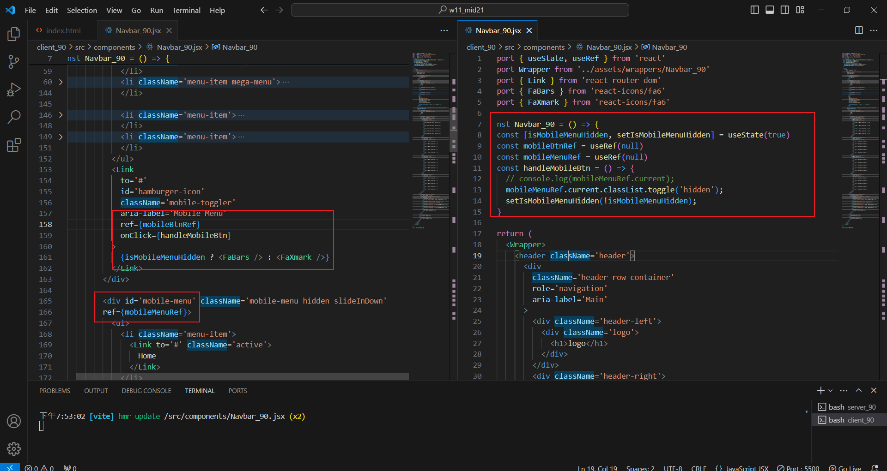
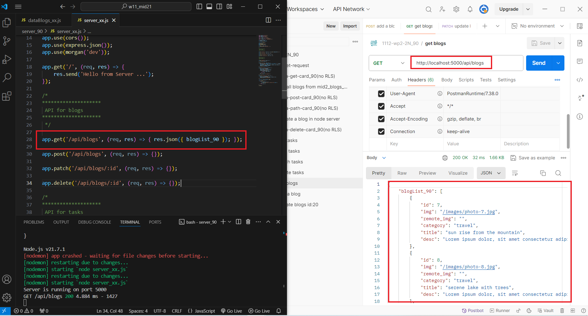
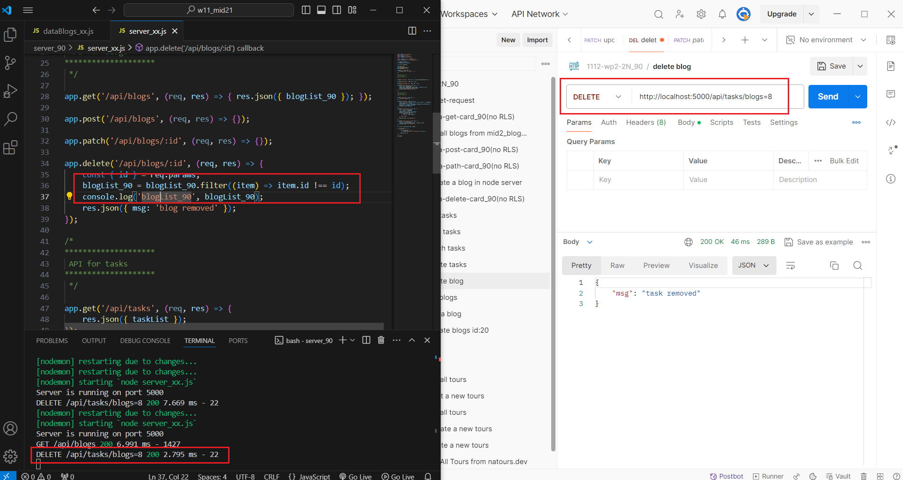
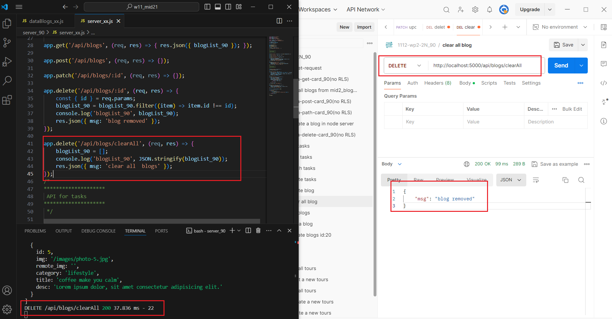
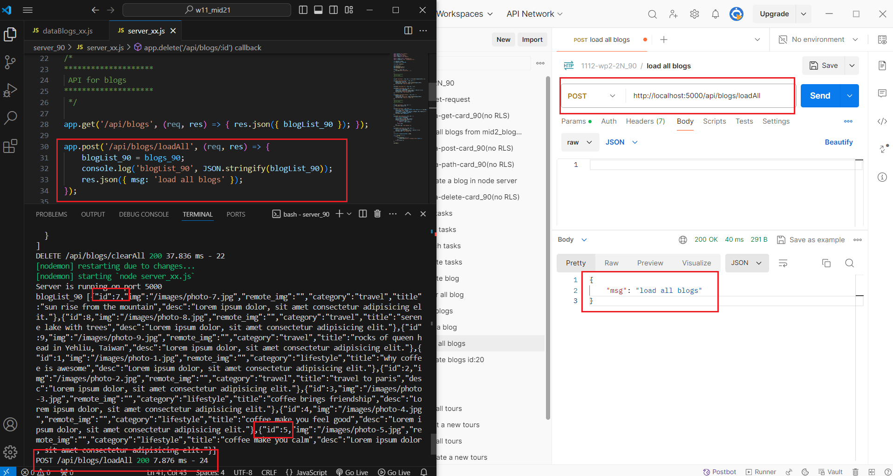

[My Github URL](https://github.com/Sky00l/1112-wp2-2N_90.git)

### ### W11-P1: Make mobileBtn work correctly
 

 


```

$ git log --pretty=format:"%h%x09%an%x09%ad%x09%s" --after="2024-05-06"
60c96aa Sky00l  Tue May 7 19:55:17 2024 +0800   W11-P1: Make mobileBtn work correctly

```

### W11-P2: Use Postman to test GET /api/blogs, and DELETE /api/blogs/:id
 

 

```

$  git log --pretty=format:"%h%x09%an%x09%ad%x09%s" --after="2024-05-03"
8f35333 Sky00l  Tue Jun 4 04:26:38 2024 +0800    W11-P2: Use Postman to test GET /api/blogs, and DELETE /api/blogs/:id

```

###  W11-P3: Use Postman to test DELETE /api/blogs/clearAll, and POST /api/blogs/loadAll
 
#### => test DELETE /api/blogs/clearAll
 

 
#### => test POST /api/blogs/loadAll
 


```


$  git log --pretty=format:"%h%x09%an%x09%ad%x09%s" --after="2024-06-03"
62df2ae Sky00l  Tue Jun 4 04:27:29 2024 +0800   W11-P3: Use Postman to test DELETE /api/blogs/clearAll, and POST /api/blogs/loadAll


### W11-P4: Git logs of W11

```

$  git log --pretty=format:"%h%x09%an%x09%ad%x09%s" --after="2024-06-03"
7c215c1 Sky00l  Sat May 4 11:47:49 2024 +0800   W10-P2: Add Navbar_xx with 3 menu items
5ed63bc Sky00l  Sat May 4 09:55:52 2024 +0800   W10-P1: Create HomeLayout_xx for all routes  

```
