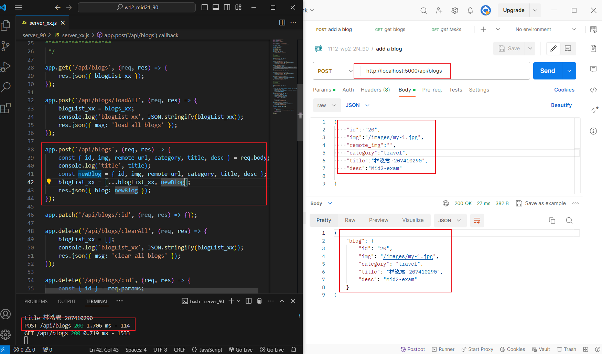
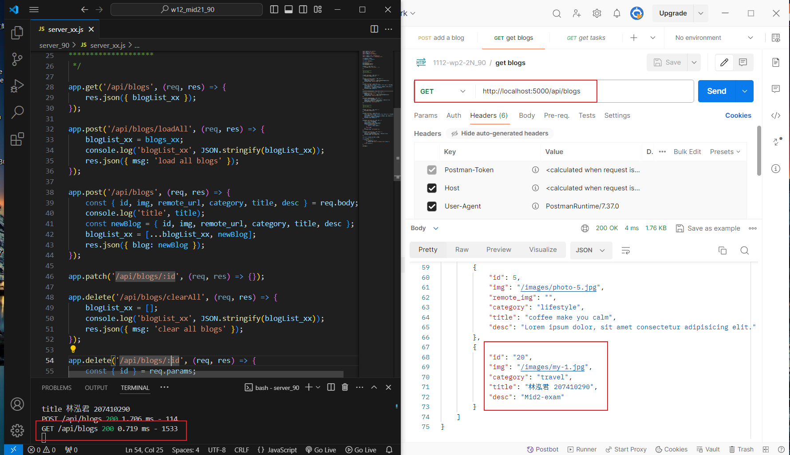
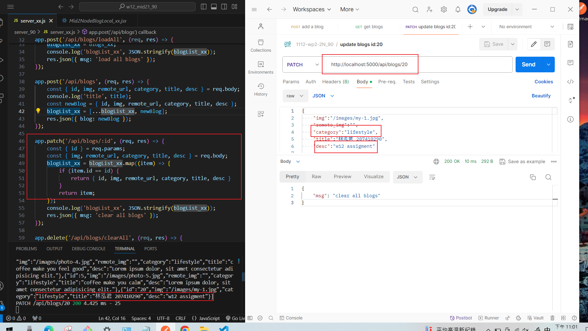
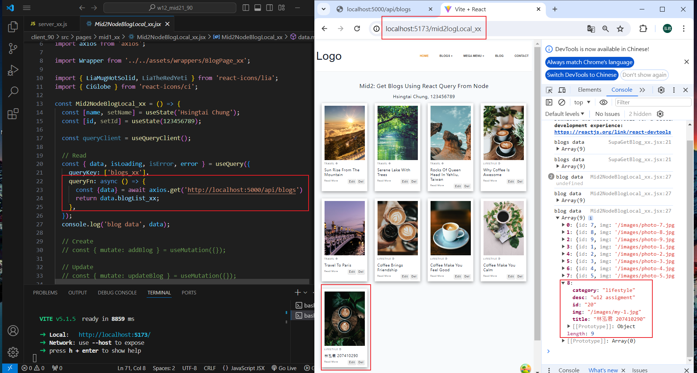

[My Github URL](https://github.com/Sky00l/1112-wp2-2N_90.git)

### W12-P1: Insert a blog using local json array
 




```

$ git log --pretty=format:"%h%x09%an%x09%ad%x09%s" --after="2024-05-07"
ff1592a Sky00l  Wed May 8 19:45:04 2024 +0800   W12-P1: Insert a blog using local json array

```

### ### W12-P2: Update a blog with id =20
 

 


```

$  git log --pretty=format:"%h%x09%an%x09%ad%x09%s" --after="2024-05-03"
7c215c1 Sky00l  Sat May 4 11:47:49 2024 +0800   W10-P2: Add Navbar_xx with 3 menu items
5ed63bc Sky00l  Sat May 4 09:55:52 2024 +0800   W10-P1: Create HomeLayout_xx for all routes  

```

### W12-P3: Use React Query to read all blogs from Node server
 


```


$  git log --pretty=format:"%h%x09%an%x09%ad%x09%s" --after="2024-05-07"
58cffd5 Sky00l  Wed May 8 20:43:30 2024 +0800   W12-P3: Use React Query to read all blogs from Node server 


### W10-P4: Git logs of W10

```

$  git log --pretty=format:"%h%x09%an%x09%ad%x09%s" --after="2024-05-03"
7c215c1 Sky00l  Sat May 4 11:47:49 2024 +0800   W10-P2: Add Navbar_xx with 3 menu items
5ed63bc Sky00l  Sat May 4 09:55:52 2024 +0800   W10-P1: Create HomeLayout_xx for all routes  

```
