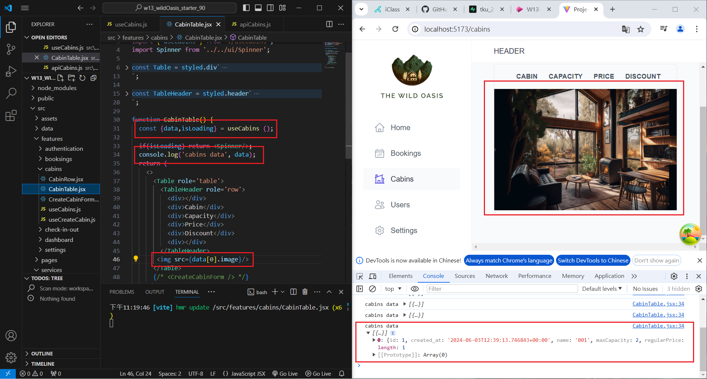

[My Github URL](https://github.com/Sky00l/1112-wp2-2N_90.git)

### W13-P1: Get first Cabins_xx data from Supabase
 


```

$ git log --pretty=format:"%h%x09%an%x09%ad%x09%s" --after="2024-06-02"
ffe3f58 Sky00l  Mon Jun 3 23:32:18 2024 +0800   W13-P1: Get first Cabins_xx data from Supabase

```

### ### W12-P2: Update a blog with id =20
 

 


```

$  git log --pretty=format:"%h%x09%an%x09%ad%x09%s" --after="2024-05-07"
09a14ef Sky00l  Sat May 11 23:04:14 2024 +0800  W12-P2: Update a blog with id =20  

```

### W12-P3: Use React Query to read all blogs from Node server
 


```


$  git log --pretty=format:"%h%x09%an%x09%ad%x09%s" --after="2024-05-07"
58cffd5 Sky00l  Wed May 8 20:43:30 2024 +0800   W12-P3: Use React Query to read all blogs from Node server 

```

### W12-P4: Insert a blog using React Query
 

 


```
$ git log --pretty=format:"%h%x09%an%x09%ad%x09%s" --after="2024-05-07"
e8ade79 Sky00l  Sat May 11 23:11:17 2024 +0800  W12-P4: Insert a blog using React Query

```

### W10-P4: Git logs of W10

```

$  git log --pretty=format:"%h%x09%an%x09%ad%x09%s" --after="2024-05-07"
e8ade79 Sky00l  Sat May 11 23:11:17 2024 +0800  W12-P4: Insert a blog using React Query
09a14ef Sky00l  Sat May 11 23:04:14 2024 +0800  W12-P2: Update a blog with id =20
58cffd5 Sky00l  Wed May 8 20:43:30 2024 +0800   W12-P3: Use React Query to read all blogs from Node server
ff1592a Sky00l  Wed May 8 19:45:04 2024 +0800   W12-P1: Insert a blog using local json array  

```
