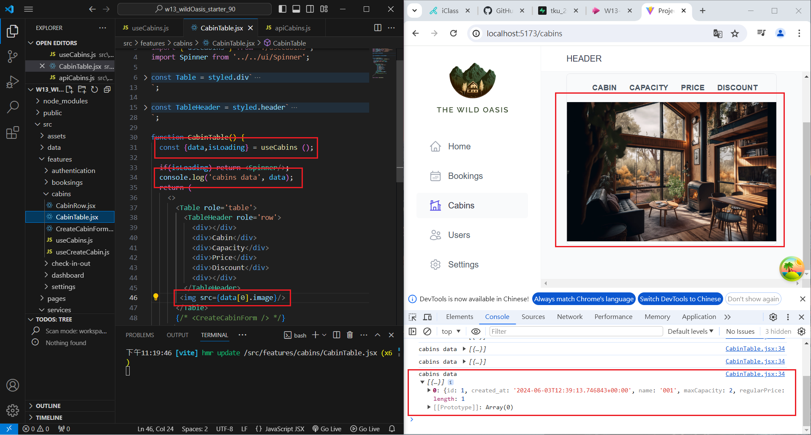
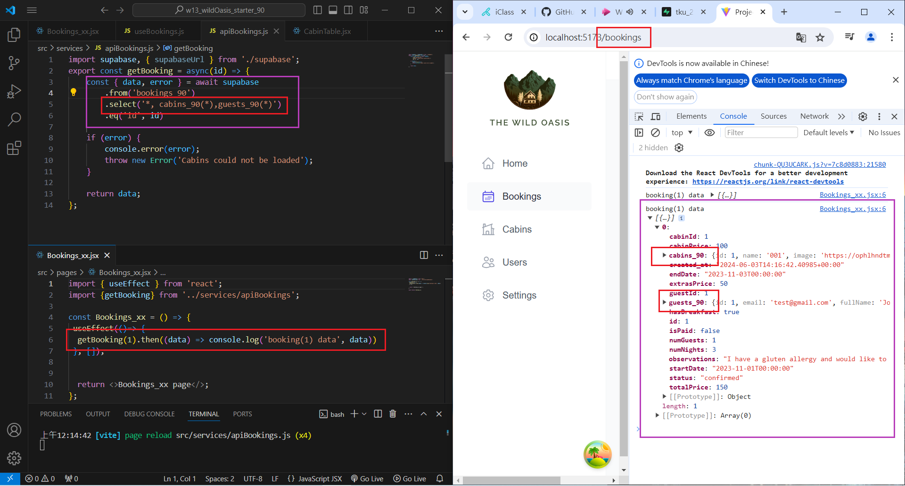

[My Github URL](https://github.com/Sky00l/1112-wp2-2N_90.git)

### W13-P1: Get first Cabins_xx data from Supabase
 


```

$ git log --pretty=format:"%h%x09%an%x09%ad%x09%s" --after="2024-06-02"
ffe3f58 Sky00l  Mon Jun 3 23:32:18 2024 +0800   W13-P1: Get first Cabins_xx data from Supabase

```

###  W13-P2: Get first booking_xx data, with corresponding cabin_xx and guest_xx data
 

 

```

$  git log --pretty=format:"%h%x09%an%x09%ad%x09%s" --after="2024-06-02"
71ef5cb Sky00l  Tue Jun 4 00:19:33 2024 +0800   W13-P2: Get first booking_xx data, with corresponding 
cabin_xx and guest_xx data 

```

### W12-P3: Use React Query to read all blogs from Node server
 


```


$  git log --pretty=format:"%h%x09%an%x09%ad%x09%s" --after="2024-05-07"
58cffd5 Sky00l  Wed May 8 20:43:30 2024 +0800   W12-P3: Use React Query to read all blogs from Node server 

```

### W13-P3: Git logs of W10

```

$  git log --pretty=format:"%h%x09%an%x09%ad%x09%s" --after="2024-06-02"
71ef5cb Sky00l  Tue Jun 4 00:19:33 2024 +0800   W13-P2: Get first booking_xx data, with corresponding 
cabin_xx and guest_xx data
ffe3f58 Sky00l  Mon Jun 3 23:32:18 2024 +0800   W13-P1: Get first Cabins_xx data from Supabase  

```
