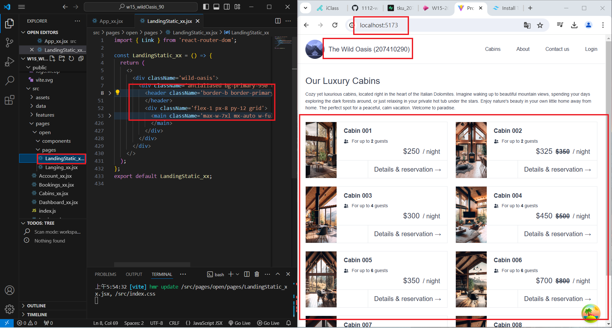
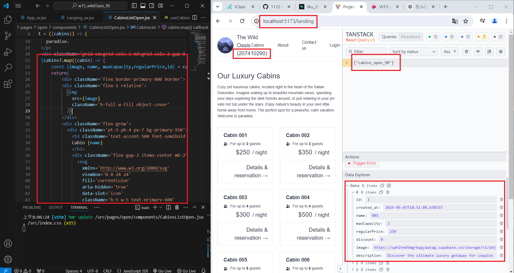
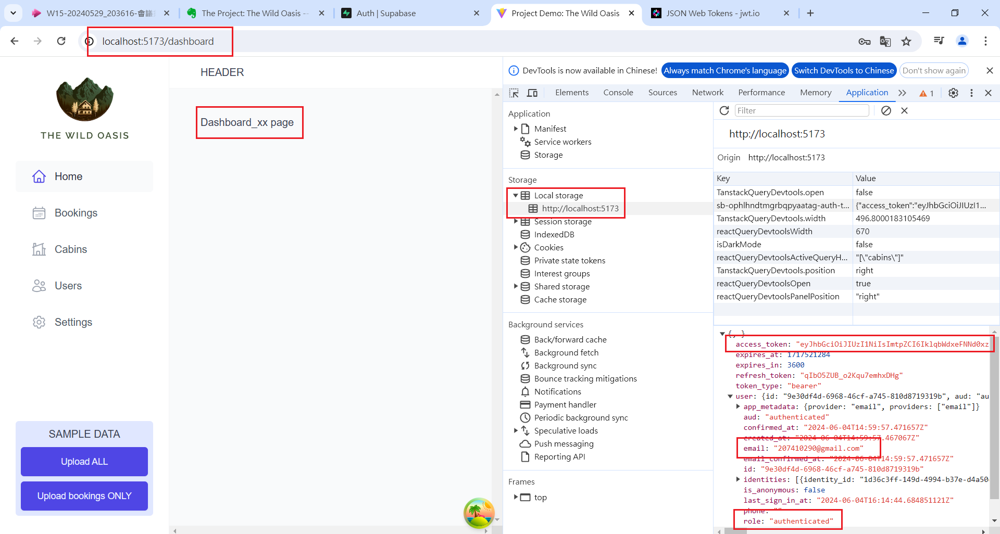
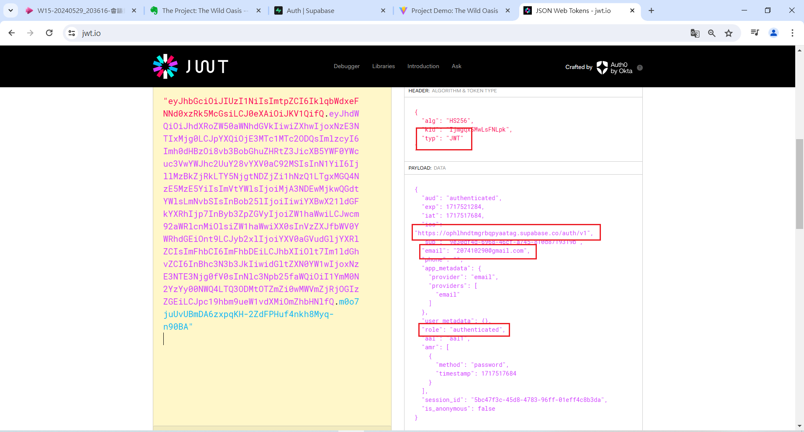
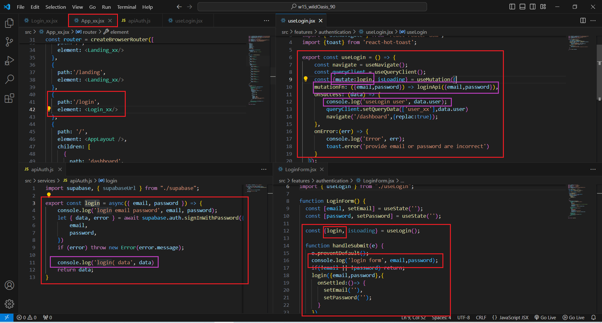
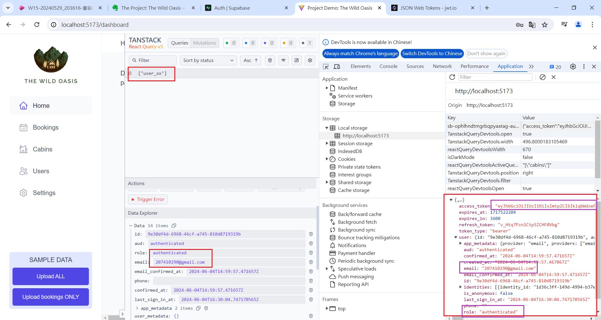

[My Github URL](https://github.com/Sky00l/1112-wp2-2N_90.git)

### W15-P1: Show static page <LandingStatic_xx /> using route /landing
 


```

$ git log --pretty=format:"%h%x09%an%x09%ad%x09%s" --after="2024-06-04"
c706a20 Sky00l  Wed Jun 5 00:44:42 2024 +0800   W15-P1: Show static page <LandingStatic_xx /> using route /landing

```

###  W15-P2: For landing page, get 8 cabins data from Supabase
 


```

$  git log --pretty=format:"%h%x09%an%x09%ad%x09%s" --after="2024-06-03"
0c80d35 Sky00l  Wed Jun 5 00:46:26 2024 +0800   W15-P2: For landing page, get 8 cabins data 
from Supabase

```

### W15-P3: Implement login using LoginForm, useLogin, login (apiAuth.jsx), navigate to /dashboard when successful

#### => login in with email (has your id), password



#### => go to jwt.io to check the jwt token with email same as above



#### => code using App_xx.jsx, LoginForm.jsx, useLogin.jsx, apiAuth.js with console.log message shown in w15-p3-4.png



#### => show console.log messages, also, with React Query DevTools



```

$  git log --pretty=format:"%h%x09%an%x09%ad%x09%s" --after="2024-06-05"
998ae31 Sky00l  Wed Jun 5 00:47:54 2024 +0800   W15-P3: Implement login using LoginForm, useLogin, login (apiAuth.jsx), navigate to /dashboard when successful

```

### W15-P4: Git logs of W10

```

$  git log --pretty=format:"%h%x09%an%x09%ad%x09%s" --after="2024-06-05"
998ae31 Sky00l  Wed Jun 5 00:47:54 2024 +0800   W15-P3: Implement login using LoginForm, useLogin, login (apiAuth.jsx), navigate to /dashboard when successful
0c80d35 Sky00l  Wed Jun 5 00:46:26 2024 +0800   W15-P2: For landing page, get 8 cabins data 
from Supabase
c706a20 Sky00l  Wed Jun 5 00:44:42 2024 +0800   W15-P1: Show static page <LandingStatic_xx /> using route /landing

```
